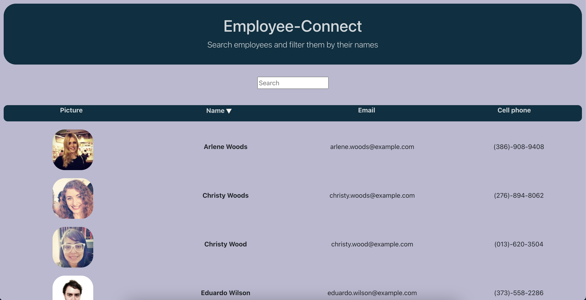
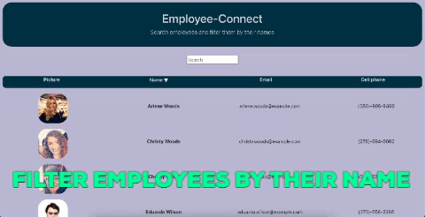
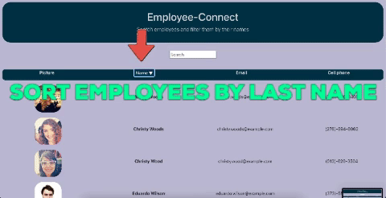

# Employee-Connect 🏢 ☕ 🦖

## Description
__Employee-Connect__ is an app that allows the user to comfortably browse the employee information such as a picture, name, phone number, and email address. The user can search employees by their first and last names as well as display their information in an ascending or descending order by their last name.

## Table of Contents
* [Installation](#Installation)
* [Usage](#Usage)
* [Tech-Stack](#Tech-Stack)
* [License](#License)
* [Contributing](#Contributing)
* [Test](#Test)
* [Questions](#Questions)

## Installation

1. Download the repo from this GitHub page. Open the repo in Visual Studio Code or another similar application. Type __yarn start__ or __npm start__ in the terminal and click enter. Enjoy using the app! 

2. The app is also deployed to __GitHub Pages__ and does not require installation: piotr72us.github.io/employee-connect/

## Usage
Scroll down the page to see the personal information of all of the employees. Enter the first or last name of a desired employee into the input field to instantly find the employee and his or her personal information. Click the triangle next to the "name" column in order to sort employees by their last name in ascending or descending order. See the screenshot and gifs for more info!

## Tech-Stack
This one-page app was built in React.js using JavaScript, JSX, CSS, and HTML. It also uses AXIOS to retrieve employees' personal informatiom from the database through API calls.

## License
This application is covered under the MIT license.

## Contributing
If you would like to team up with me to improve the app, please let me know.

## Test
Testing will be developed in the future.

## Questions
If you have additional questions, you can reach me via my GitHub profile: [Piotr72us](https://github.com/Piotr72us) 
or send me an email at: piotr72@gmail.com
